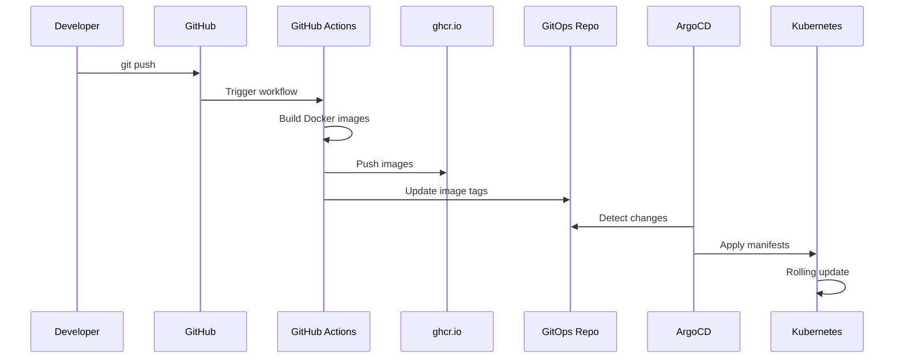

# 🚀 Guia de Deployment GitOps - Linktree

Este documento explica o processo completo de deployment usando GitOps com ArgoCD.

## 📋 Visão Geral

Nosso processo de deployment segue a metodologia GitOps:

```
Developer → Git Push → GitHub Actions → Build Images → Update GitOps → ArgoCD Sync → Kubernetes
```

## 🏗️ Arquitetura

### Repositórios

1. **linktree** (este repo): Código da aplicação + Helm Chart
2. **argocd-gitops**: Configuração de infraestrutura (GitOps)

### Fluxo Completo



## 🔄 Processo de Deploy

### 1. Desenvolvimento

```bash
# Fazer mudanças no código
vim linktree-backend/src/server.js

# Commit e push
git add .
git commit -m "feat: add new feature"
git push origin main
```

### 2. CI/CD Automático

O GitHub Actions executa automaticamente:

1. ✅ **Validação do Helm Chart**
   ```bash
   helm lint ./helm
   helm template ./helm -f values.prod.yaml
   ```

2. 🏗️ **Build das Imagens**
   - Backend: `ghcr.io/periclesanfe/linktree-backend:SHA`
   - Frontend: `ghcr.io/periclesanfe/linktree-frontend:SHA`

3. 📦 **Push para Registry**
   - Tags: `main-SHA`, `latest`, `SHA`

4. 🔄 **Atualização do GitOps**
   - Checkout do repo `argocd-gitops`
   - Atualiza `application.yaml` com nova tag
   - Commit com `[skip ci]`

### 3. ArgoCD Sync

ArgoCD detecta a mudança e:

1. **Compara** Git vs Cluster
2. **Planeja** as mudanças necessárias
3. **Aplica** com sync waves:
   - Wave -1: Migration Job
   - Wave 0: Secrets, ConfigMaps
   - Wave 1: Deployments, Services
   - Wave 2: Ingress

4. **Monitora** health dos recursos

### 4. Kubernetes Deploy

```bash
# Kubernetes executa rolling update
kubectl rollout status deployment/linktree-prod-backend -n prod

# Zero downtime:
# 1. Cria novos pods com nova imagem
# 2. Aguarda health checks
# 3. Redireciona tráfego
# 4. Remove pods antigos
```

## 📊 Monitoramento

### ArgoCD UI

```bash
# Port-forward
kubectl port-forward svc/argocd-server -n argocd 8080:443

# Login
argocd login localhost:8080

# Ver aplicações
argocd app list
argocd app get linktree-prod
```

### Logs

```bash
# Backend logs
kubectl logs -n prod -l app.kubernetes.io/component=backend --tail=100 -f

# Frontend logs
kubectl logs -n prod -l app.kubernetes.io/component=frontend --tail=100 -f

# Filtrar erros (JSON logs)
kubectl logs -n prod deploy/linktree-prod-backend | jq 'select(.level=="error")'

# Logs das últimas 2 horas
kubectl logs -n prod deploy/linktree-prod-backend --since=2h
```

### Status dos Recursos

```bash
# Overview completo
kubectl get all -n prod

# Deployments
kubectl get deployments -n prod -o wide

# Pods com idade
kubectl get pods -n prod -o wide

# Events recentes
kubectl get events -n prod --sort-by='.lastTimestamp' | tail -20

# Describe pod com problema
kubectl describe pod POD_NAME -n prod
```

## 🔄 Rollback

### Opção 1: Via ArgoCD (Recomendado)

```bash
# Via CLI
argocd app history linktree-prod
argocd app rollback linktree-prod REVISION_NUMBER

# Via UI
# 1. Abrir app no ArgoCD
# 2. History and Rollback
# 3. Selecionar versão
# 4. Rollback
```

### Opção 2: Via Git

```bash
# Reverter commit no GitOps
cd argocd-gitops
git revert HEAD
git push

# ArgoCD sincronizará automaticamente
```

### Opção 3: Via kubectl (Emergência)

```bash
# Rollback último deployment
kubectl rollout undo deployment/linktree-prod-backend -n prod

# Ver histórico
kubectl rollout history deployment/linktree-prod-backend -n prod

# Rollback para revisão específica
kubectl rollout undo deployment/linktree-prod-backend --to-revision=3 -n prod
```

## 🐛 Troubleshooting

### Pods Não Iniciam

```bash
# 1. Ver status do pod
kubectl get pod POD_NAME -n prod

# 2. Descrever pod (ver events)
kubectl describe pod POD_NAME -n prod

# 3. Ver logs
kubectl logs POD_NAME -n prod

# Problemas comuns:
# - ImagePullBackOff: Verificar credenciais registry
# - CrashLoopBackOff: App falhando ao iniciar (ver logs)
# - Pending: Falta de recursos (CPU/Memory)
```

### ArgoCD OutOfSync

```bash
# Ver diferenças
argocd app diff linktree-prod

# Forçar sync
argocd app sync linktree-prod --force

# Sync com prune
argocd app sync linktree-prod --prune
```

### Migration Job Falha

```bash
# Ver logs do job
kubectl logs -n prod job/linktree-prod-db-migration

# Deletar job para retry
kubectl delete job linktree-prod-db-migration -n prod

# ArgoCD recriará no próximo sync
argocd app sync linktree-prod
```

### Database Não Conecta

```bash
# Verificar cluster PostgreSQL
kubectl get cluster -n prod

# Ver pods do banco
kubectl get pods -n prod -l postgresql=linktree-prod-postgresql

# Testar conexão
kubectl run -it --rm psql-test \
  --image=postgres:16-alpine \
  --restart=Never \
  -n prod -- \
  psql -h linktree-prod-postgresql-rw -U linktree_prod_user -d linktree_prod
```

## 🔐 Segurança

### Secrets Management

```bash
# Ver secrets (sem mostrar valores)
kubectl get secrets -n prod

# Criar secret manualmente
kubectl create secret generic my-secret \
  --from-literal=key=value \
  -n prod

# Usar Sealed Secrets (recomendado)
kubeseal -f secret.yaml -w sealed-secret.yaml
kubectl apply -f sealed-secret.yaml
```

### RBAC

```bash
# Ver permissões
kubectl auth can-i --list --as=system:serviceaccount:prod:default

# Criar role
kubectl create role pod-reader \
  --verb=get,list \
  --resource=pods \
  -n prod
```

## 📈 Ambientes

### Development

- **Branch**: `develop`
- **Namespace**: `dev`
- **Replicas**: 1 backend, 1 frontend
- **Database**: 1 instância
- **Auto-sync**: Habilitado

### Production

- **Branch**: `main`
- **Namespace**: `prod`
- **Replicas**: 3 backend, 3 frontend
- **Database**: 3 instâncias (HA)
- **Auto-sync**: Habilitado
- **Backups**: A cada 6 horas

## 🎯 Métricas

### Health Checks

```bash
# Backend health
curl http://linktree-prod-backend:8000/api/health

# Resposta esperada:
# {
#   "status": "healthy",
#   "timestamp": "2024-11-08T...",
#   "uptime": 3600
# }
```

### Logs Estruturados

Logs em produção são JSON:

```json
{
  "level": "info",
  "message": "HTTP Request",
  "method": "GET",
  "url": "/api/links",
  "statusCode": 200,
  "responseTime": "45ms",
  "timestamp": "2024-11-08T10:30:00.000Z"
}
```

Filtrar com jq:

```bash
# Apenas erros
kubectl logs deploy/linktree-prod-backend -n prod | jq 'select(.level=="error")'

# Requisições lentas (>500ms)
kubectl logs deploy/linktree-prod-backend -n prod | \
  jq 'select(.responseTime | tonumber > 500)'

# Agrupar por endpoint
kubectl logs deploy/linktree-prod-backend -n prod | \
  jq -r '.url' | sort | uniq -c
```

## 📚 Comandos Úteis

```bash
# Ver todas as apps do ArgoCD
kubectl get applications -n argocd

# Port-forward frontend
kubectl port-forward -n prod svc/linktree-prod-frontend 3000:80

# Port-forward backend
kubectl port-forward -n prod svc/linktree-prod-backend 8000:8000

# Escalar deployment
kubectl scale deployment linktree-prod-backend --replicas=5 -n prod

# Ver uso de recursos
kubectl top pods -n prod
kubectl top nodes

# Restart deployment (sem downtime)
kubectl rollout restart deployment/linktree-prod-backend -n prod

# Ver configuração atual
kubectl get configmap linktree-prod-backend-config -n prod -o yaml
kubectl get secret linktree-prod-db-secret -n prod -o yaml
```

## 🚨 Alertas e Notificações

### Configurar Slack (Opcional)

No ArgoCD:

```yaml
apiVersion: v1
kind: ConfigMap
metadata:
  name: argocd-notifications-cm
  namespace: argocd
data:
  service.slack: |
    token: $slack-token
  trigger.on-deployed: |
    when: app.status.operationState.phase in ['Succeeded']
    send: [app-deployed]
```

## 📖 Referências

- [ArgoCD Documentation](https://argo-cd.readthedocs.io/)
- [Kubernetes Best Practices](https://kubernetes.io/docs/concepts/configuration/overview/)
- [Helm Documentation](https://helm.sh/docs/)
- [12-Factor App](https://12factor.net/)

---

**Última atualização**: 2024-11-08  
**Mantido por**: DevOps Team
